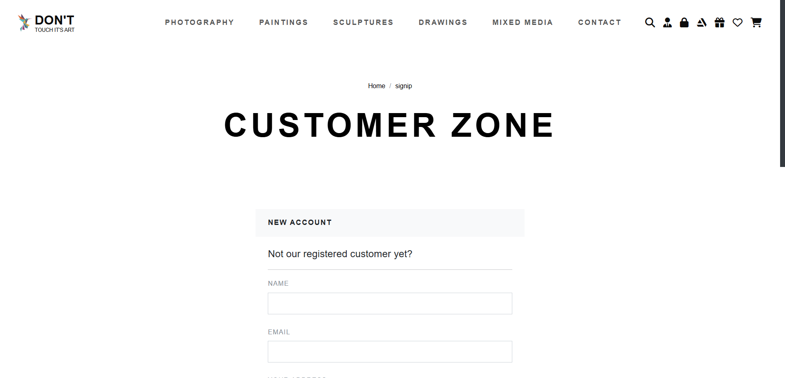
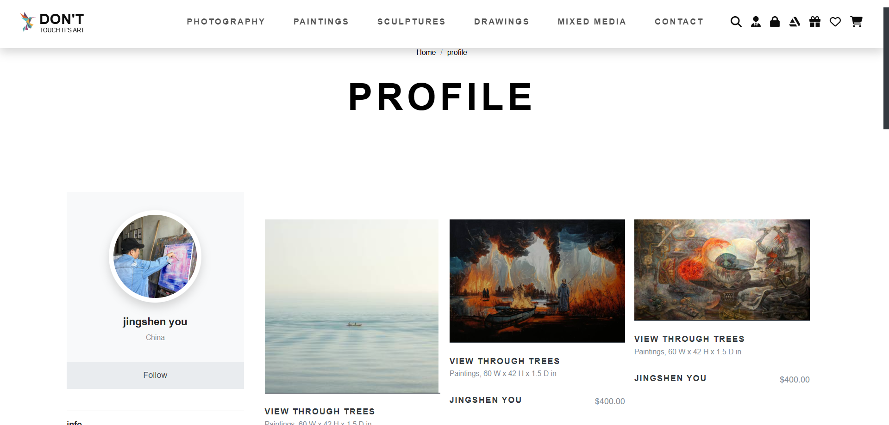

# 🎨 Software Engineering Web App

A web-based platform for managing users, artists, and administrators. This project showcases modular architecture, user management, and a structured PHP backend.

## 📌 Features

- 🔐 User authentication (login/register)
- 🎭 Artist profile management
- 🧑‍💼 Admin dashboard with control over users and content
- 📱 Responsive front-end interface
- 📊 System design and architecture diagrams included

## 📂 Project Structure

```
software-engineering/
├── admin/             # Admin dashboard and pages
├── artist/            # Artist pages and features
├── classes/           # PHP class logic
├── css/               # Stylesheets
├── diagrams/          # System and design diagrams
├── img/               # Static images
├── js/                # JavaScript code
├── user/              # User-facing pages
├── webfonts/          # Font assets
├── index.php          # Main landing page
├── header.php         # Shared header
├── artist_header.php  # Artist-specific header
├── user_header.php    # User-specific header
```

## 🛠️ Installation

1. **Clone the repository**:
   ```bash
   git clone https://github.com/josephadel25/software-engineering.git
   ```

2. **Set up your local server** (e.g., XAMPP/WAMP):
   - Place the project inside the `htdocs/` folder.
   - Start Apache and MySQL from your server panel.

3. **Configure the Database**:
   - Create a new MySQL database (e.g., `webapp_db`).
   - Import the SQL file (if provided) into phpMyAdmin.
   - Update database credentials in the PHP files inside `classes/`.

4. **Run the application**:
   - Open a browser and go to: `http://localhost/software-engineering/`

## 📸 Screenshots

### 🏠 Home Page


### 🔐 Login Page


### 🎨 Artist Profile


### 🧑‍💼 Sculptures Home


## 🧭 Diagrams

System design and architecture diagrams are stored in the [`diagrams/`](diagrams/) folder for reference and documentation.

You can download the entire project as a ZIP including diagrams:
[Download ZIP](https://github.com/josephadel25/software-engineering/archive/refs/heads/main.zip)

## 🧪 Technologies Used

- PHP
- HTML5
- CSS3 / Bootstrap
- JavaScript
- MySQL
- FontAwesome / WebFonts

## 🤝 Contribution Guidelines

Contributions are welcome! Here's how:

1. Fork the repo
2. Create a new branch:
   ```bash
   git checkout -b feature/my-feature
   ```
3. Make your changes and commit:
   ```bash
   git commit -m "Add: My new feature"
   ```
4. Push to your fork and open a Pull Request.

## 📄 License

This project is licensed under the MIT License. Feel free to use and modify it.

## 📬 Contact

Created by [@josephadel25](https://github.com/josephadel25)  
Feel free to open an issue or contribute!
